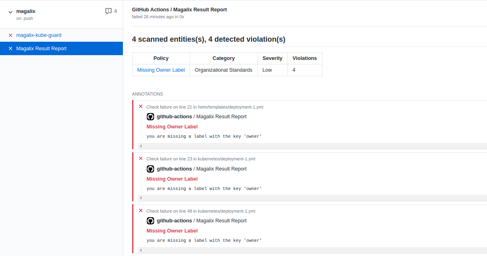
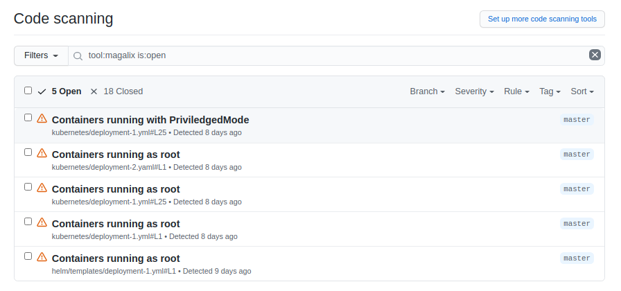

# Magalix Github Action

Identify violations in your IaC files using Magalix Action.

## Usage

```yml
# .github/workflows/magalix.yml
name: Magalix

on:
  push:
    branches: [ master ]
  pull_request:
    branches: [ master ]

jobs:
  magalix:
    runs-on: ubuntu-latest
    steps:
    - uses: actions/checkout@v2
    - name: Magalix
      uses: magalixcorp/magalix-action@main
      with:
        webhook: ${{ secrets.GUARD_WEBHOOK }}
```

> Its highly recommended to not hard-code the webhook url in the file, Instead you should add it as a repository or origanization secret and use the secret name in the file.


## Parameters

| Name                | Description                 | Required  | Default         |
| ------------------- | --------------------------- | --------- | --------------- |
| `webhook`           | Guard webhook url           |    Yes    |                 |
| `directory`         | Root directory to scan      |    No     | repository root |
| `gh-code-scanning`  | Enable github code scanning |    No     | yes             |
| `auto-remediation`  | Enable auto remediation     |    No     | yes             |


## Result Report



## Github Code Scanning

Magalix action supports [Github Code Scanning](https://docs.github.com/en/code-security/secure-coding/about-code-scanning). 

If [Github Advanced Security](https://docs.github.com/en/github/getting-started-with-github/about-github-advanced-security) is enabled in your repository you will be able to see the security alerts under the Security tab.


